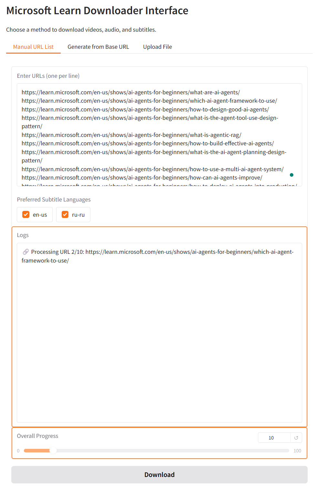

# LearnVideoDownloader

*LearnVideoDownloader* is a Python script designed to download videos, audios and subtitles from the Microsoft Learn platform. The script allows users to specify the quality of videos and the preferred languages for subtitles.



## Features

- Download videos in high, medium, or low quality
- Download audio files
- Download subtitles in specified languages
- Configurable download directory through environment variables
- User-friendly GUI interface with:
  - Manual URL list input
  - Smart URL sequence generation from two sample URLs
  - File upload for batch processing
- Command-line interface for automation

## Important

- Downloads videos and audio files in their original quality without re-encoding
- By default, files are saved in the `downloads` directory within the project folder

## Requirements

- Python 3.x
- Requests library
- BeautifulSoup library
- python-dotenv library
- Gradio library (for GUI)

## Installation

1. Clone the repository:

```bash
git clone https://github.com/loglux/LearnVideoDownloader.git
```

2. Navigate to the project directory:

```bash
cd LearnVideoDownloader
```

3. Install the required libraries:
```bash
pip install requests beautifulsoup4 tqdm python-dotenv gradio
```

## Configuration

You can configure the download directory by setting the `DOWNLOAD_DIR` environment variable. There are two ways to do this:

1. Create a `.env` file in the project root and add:
```
DOWNLOAD_DIR=/path/to/your/download/directory
```

2. Or set the environment variable directly in your shell:
```bash
# Linux/Mac
export DOWNLOAD_DIR=/path/to/your/download/directory

# Windows
set DOWNLOAD_DIR=C:\path\to\your\download\directory
```

If no download directory is specified, files will be saved in the `downloads` directory within the project folder.

## Usage

### GUI Interface

To start the graphical interface:
```bash
python gradio_ui.py
```

The GUI provides three ways to download content:
1. **Manual URL List**: Enter multiple URLs (one per line)
2. **Generate from Base URL**: Enter two sample URLs (e.g., module-4 and module-5) and the tool will generate a sequence starting from module-1
3. **Upload File**: Upload a text file containing URLs (one per line)

### Command Line Interface

For automation or scripting, you can still use the command-line interface:

```python
from learn_video_helper import VideoDownloader

urls = [
    "https://learn.microsoft.com/en-us/shows/on-demand-instructor-led-training-series/ai-050-module-1/",
    "https://learn.microsoft.com/en-us/shows/on-demand-instructor-led-training-series/ai-050-module-2/",
    # Add more URLs as needed
]
preferred_languages = ['en-us', 'ru-ru']  # Example preferred languages: English and Russian subtitles

for url in urls:
    downloader = VideoDownloader(url)
    downloader.run(
        download_high_quality=True,
        download_medium_quality=False,
        download_low_quality=False,
        download_audio=True,
        download_captions=True,
        preferred_languages=preferred_languages
    )
```

## Fetch All Links in a Video Series
The LearnVideoFetcher script extends the functionality of the main project by dynamically generating URLs for a series of videos based on a specified base URL and number of modules.
### Usage:
To fetch all links in a video series, follow these steps:
Run the Script:
```bash
python fetch_all_links.py [base_url] [num_modules]
```
Replace [base_url] with any URL from the series and [num_modules] with the total number of modules in the series.

### Example:

Suppose you have a series with a URL like "https://learn.microsoft.com/en-us/shows/on-demand-instructor-led-training-series/ai-900-module-3" and there are 7 modules in the series. You can generate URLs dynamically by passing the URL as it is:
```bash
python fetch_all_links.py https://learn.microsoft.com/en-us/shows/on-demand-instructor-led-training-series/ai-900-module-3 7
```
This script will automatically generate URLs for modules 1 through 7 and download their associated content.

## Fetch Links from File

In addition to the existing functionality, the script allows you to fetch and download content from a text file containing a list of links.

### How to Use:
1. Save your list of links in a file (for example, `links.txt`).
2. Run the script, specifying the file path that contains the links:
```bash
python fetch_from_file.py links.txt --languages en-us ru-ru
```
In this command, --languages is an optional argument to specify the preferred languages for subtitles.
This script should correctly process each link from your file and perform the necessary operations with each of them, including downloading videos and subtitles.

## License
This project is licensed under the MIT License.
