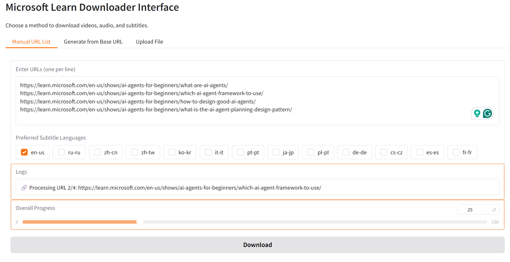
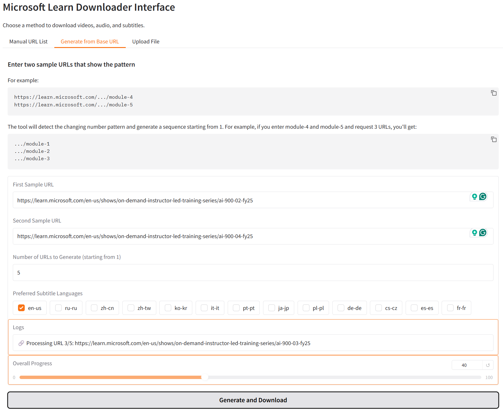
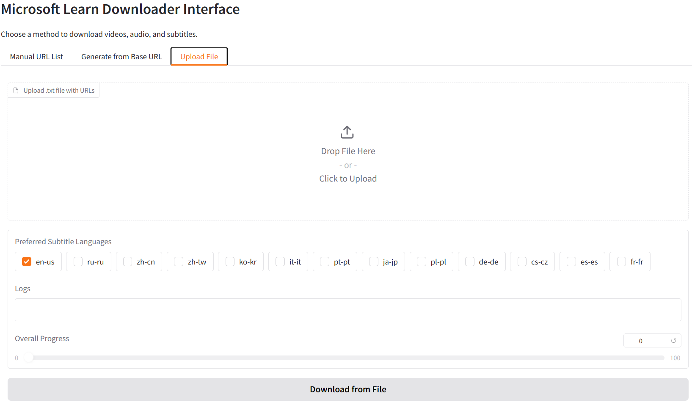

# LearnVideoDownloader — Microsoft Learn Video, Audio & Subtitle Downloader

*LearnVideoDownloader* is a Python script designed to download videos, audios and subtitles from the Microsoft Learn platform. The script allows users to specify the quality of videos and the preferred languages for subtitles.




---
## Features

- **Smart Video Quality Fallback**: Automatically downloads the best available quality (high → medium → low)
- **Granular Content Selection**: Choose exactly what to download (Video, Audio, Subtitles) through the GUI
- Download videos in high, medium, or low quality
- Download audio files independently
- Download subtitles in specified languages
- Configurable download directory through environment variables
- User-friendly GUI interface with:
  - Manual URL list input
  - Smart URL sequence generation from two sample URLs
  - File upload for batch processing
  - Content type selection (Video, Audio, Subtitles)
- Command-line interface for automation
---
## 🎯 Why LearnVideoDownloader?

Unlike generic tools like `yt-dlp`, which require manual extraction of streaming manifests (`.m3u8` or `.mpd`) using browser developer tools, **LearnVideoDownloader** is purpose-built for Microsoft Learn:

-   🔗 **Paste a Microsoft Learn URL — and it just works**  
    No need to inspect network requests or parse manifests.
    
-   🧠 **Understands Microsoft Learn structure**  
    Detects video, audio, and subtitle links automatically.
    
-   📋 **Batch downloads entire course modules**  
    Generate and process full module series with just two sample links.
    
-   🖼️ **User-friendly GUI and CLI support**  
    Ideal for both non-technical users and advanced scripting workflows.
    
-   🧾 **Supports subtitles in multiple languages**  
    Download `.vtt` files in selected locales like `en-us`, `ru-ru`, etc.
    

> 🆚 **In contrast**, using `yt-dlp` often involves:
> 
> -   Opening DevTools in browser
>     
> -   Finding and copying manifest URLs
>     
> -   Constructing download commands manually
>     
> -   Troubleshooting formats and parameters
>     

**LearnVideoDownloader saves time and frustration by automating all of this.**
---
## Smart Video Quality Fallback

The system automatically selects the best available video quality:

1. **If high quality is available** → downloads high quality only
2. **If high quality unavailable but medium available** → automatically falls back to medium quality
3. **If only low quality available** → falls back to low quality
4. **Downloads only ONE video file per entry** (the best available quality)

This ensures you always get the best possible video quality without manual intervention, while avoiding duplicate downloads.

## Content Type Selection

The GUI now allows granular control over what content to download:

- **Video**: Downloads the best available video quality with automatic fallback
- **Audio**: Downloads audio track independently 
- **Subtitles**: Downloads captions in selected languages

You can choose any combination (e.g., only audio + subtitles, or only video, etc.).
---
## Important

- Downloads videos and audio files in their original quality without re-encoding
- By default, files are saved in the `downloads` directory within the project folder
---
### 🔗 Smart URL Sequence Generation

Some Microsoft Learn course URLs use numbers with leading zeros (e.g. `ai-900-01-fy25`), while others use plain numbers (e.g. `module-19`).  
Our Smart URL Generator works with **any two sample URLs** from the same video series.

#### **How to use:**
1. Copy any two links from the course sequence — for example:
   - `https://learn.microsoft.com/en-us/shows/on-demand-instructor-led-training-series/ai-900-02-fy25`
   - `https://learn.microsoft.com/en-us/shows/on-demand-instructor-led-training-series/ai-900-04-fy25`
   - or
   - `https://learn.microsoft.com/en-us/shows/on-demand-instructor-led-training-series/az-104-module-4`
   - `https://learn.microsoft.com/en-us/shows/on-demand-instructor-led-training-series/az-104-module-6`

2. Paste them into the “Smart URL Generation” fields in the app and specify how many videos you want to generate.

3. The generator will automatically detect which number should be incremented and preserve leading zeros if present.

> **Tip:**  
> You can use any two samples from the sequence (e.g. 4 and 6, or 01 and 03) — they do not have to be consecutive.

#### **Examples:**
- For samples `...ai-900-02-fy25` and `...ai-900-04-fy25` with count 5, the output will be:
```
...ai-900-01-fy25
...ai-900-02-fy25
...ai-900-03-fy25
...ai-900-04-fy25
...ai-900-05-fy25
```

`
- For samples `...module-4` and `...module-6` with count 3, the output will be:
```
...module-1
...module-2
...module-3
```
> If your course uses links with leading zeros, the generator will keep them; if not, the output will use plain numbers.
---
## Requirements

- Python 3.x
- Requests library
- BeautifulSoup library
- python-dotenv library
- Gradio library (for GUI)
---
## Installation

1. Clone the repository:

```bash
git clone https://github.com/loglux/LearnVideoDownloader.git
```

2. Navigate to the project directory:

```bash
cd LearnVideoDownloader
```

3. Install the required libraries:
```bash
pip install requests beautifulsoup4 tqdm python-dotenv gradio
```
---
## Configuration

You can configure the download directory by setting the `DOWNLOAD_DIR` environment variable. There are two ways to do this:

1. Create a `.env` file in the project root and add:
```
DOWNLOAD_DIR=/path/to/your/download/directory
```

2. Or set the environment variable directly in your shell:
```bash
# Linux/Mac
export DOWNLOAD_DIR=/path/to/your/download/directory

# Windows
set DOWNLOAD_DIR=C:\path\to\your\download\directory
```

If no download directory is specified, files will be saved in the `downloads` directory within the project folder.
---
## Usage

### GUI Interface

To start the graphical interface:
```bash
python gradio_ui.py
```

The GUI provides three ways to download content:
1. **Manual URL List**: Enter multiple URLs (one per line)
2. **Generate from Base URL**: Enter two sample URLs (e.g., module-4 and module-5) and the tool will generate a sequence starting from module-1
3. **Upload File**: Upload a text file containing URLs (one per line)

#### Content Selection

For each method, you can choose what to download:

- **Video**: Enables smart quality fallback (high → medium → low)
- **Audio**: Downloads audio tracks
- **Subtitles**: Downloads captions in selected languages

**Example scenarios:**
- Select **Video + Audio + Subtitles**: Downloads best video quality + audio + captions
- Select **Audio + Subtitles only**: Downloads audio and captions, skips video
- Select **Video only**: Downloads best available video quality only

### Command Line Interface

For automation or scripting, you can still use the command-line interface:

```python
from learn_video_helper import VideoDownloader

urls = [
    "https://learn.microsoft.com/en-us/shows/on-demand-instructor-led-training-series/ai-050-module-1/",
    "https://learn.microsoft.com/en-us/shows/on-demand-instructor-led-training-series/ai-050-module-2/",
    # Add more URLs as needed
]
preferred_languages = ['en-us', 'ru-ru']  # Example preferred languages: English and Russian subtitles

for url in urls:
    downloader = VideoDownloader(url)
    downloader.run(
        download_high_quality=True,
        download_medium_quality=False,
        download_low_quality=False,
        download_audio=True,
        download_captions=True,
        preferred_languages=preferred_languages
    )
```

## Fetch All Links in a Video Series
The LearnVideoFetcher script extends the functionality of the main project by dynamically generating URLs for a series of videos based on a specified base URL and number of modules.
### Usage:
To fetch all links in a video series, follow these steps:
Run the Script:
```bash
python fetch_all_links.py [base_url] [num_modules]
```
Replace [base_url] with any URL from the series and [num_modules] with the total number of modules in the series.

### Example:

Suppose you have a series with a URL like "https://learn.microsoft.com/en-us/shows/on-demand-instructor-led-training-series/ai-900-module-3" and there are 7 modules in the series. You can generate URLs dynamically by passing the URL as it is:
```bash
python fetch_all_links.py https://learn.microsoft.com/en-us/shows/on-demand-instructor-led-training-series/ai-900-module-3 7
```
This script will automatically generate URLs for modules 1 through 7 and download their associated content.

## Fetch Links from File

In addition to the existing functionality, the script allows you to fetch and download content from a text file containing a list of links.

### How to Use:
1. Save your list of links in a file (for example, `links.txt`).
2. Run the script, specifying the file path that contains the links:
```bash
python fetch_from_file.py links.txt --languages en-us ru-ru
```
In this command, --languages is an optional argument to specify the preferred languages for subtitles.
This script should correctly process each link from your file and perform the necessary operations with each of them, including downloading videos and subtitles.

## License
This project is licensed under the MIT License.
